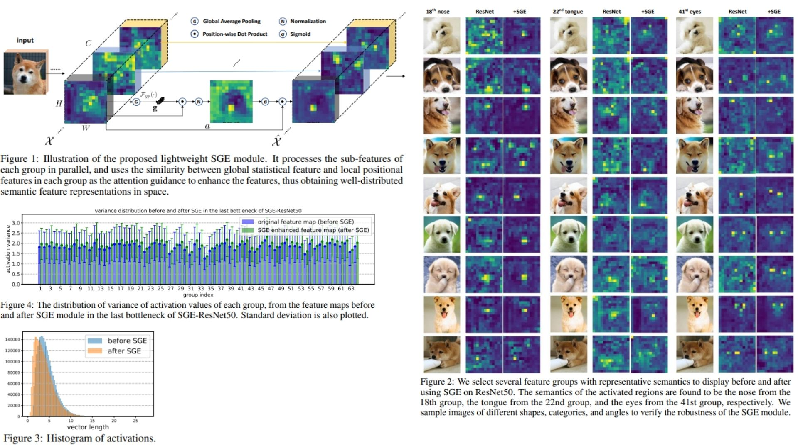

# 🐠 SGE-Replication — Spatial Group-wise Enhance in Convolutional Networks

This repository provides a **clean, forward-only PyTorch replication** of the
*Spatial Group-wise Enhance (SGE)* module proposed in  
*Spatial Group-wise Enhance: Improving Semantic Feature Learning in Convolutional Networks*.

The purpose is **architectural and theoretical fidelity**: translating the paper’s
**group-wise semantic assumption, similarity-based attention formulation, and
lightweight design** into minimal, readable code — **without training, datasets,
or benchmark evaluation**.

The focus is strictly on how **semantic sub-features within channel groups**
can **self-enhance their spatial distributions** using global–local similarity,
rather than channel competition or heavy attention mechanisms ⟁.

Paper reference:  [Spatial Group-wise Enhance: Improving Semantic Feature Learning in Convolutional Networks (arXiv 2019)](https://arxiv.org/abs/1905.09646)

---

## Overview — Semantic Groups That Organize Themselves ◈



>Convolutional feature maps implicitly contain multiple semantic entities
>distributed across channels. These entities often appear as **groups of
>sub-features**, each corresponding to object parts or high-level concepts.

However, due to noisy backgrounds and weak spatial supervision, these grouped
features tend to activate **incoherently across space**, leading to ambiguous
localization and diluted semantic responses.

SGE addresses this by introducing a **spatial self-enhancement mechanism inside
each semantic group**, allowing every group to autonomously:

- Strengthen spatially consistent semantic regions ◌
- Suppress irrelevant or noisy activations ◍
- Preserve lightweight computation and parameter efficiency ◐

Crucially, this enhancement is guided **only by the similarity between global
and local descriptors within each group**, without cross-group interaction or
external supervision.

---

## Spatial Group-wise Enhance Formulation 🧮

Consider a convolutional feature map

$$
X \in \mathbb{R}^{C \times H \times W}
$$

which is divided into $G$ groups along the channel dimension.  
Each group contains $C/G$ channels and defines a set of spatial vectors:

$$
X_g = \{ x_1, x_2, \dots, x_m \}, \quad x_i \in \mathbb{R}^{C/G}, \quad m = H \times W
$$

### Global Semantic Descriptor

For each group, a global semantic vector is obtained via spatial averaging:

$$
g = \frac{1}{m} \sum_{i=1}^{m} x_i
$$

This vector approximates the **semantic entity** represented by the group.

---

### Similarity-based Spatial Attention

Each spatial location is assigned an importance coefficient via dot-product
similarity:

$$
c_i = g \cdot x_i
$$

These coefficients are normalized across spatial positions:

$$
\hat{c}_i = \frac{c_i - \mu_c}{\sigma_c + \varepsilon}
$$

and transformed using learnable scale and shift parameters:

$$
a_i = \gamma \hat{c}_i + \beta
$$

Finally, the original feature vector is enhanced through a sigmoid gate:

$$
\hat{x}_i = x_i \cdot \sigma(a_i)
$$

This operation selectively amplifies spatial locations that are **globally
consistent with the group’s semantic identity**, while compressing noise.

---

## Architectural Interpretation ◬

- Enhancement operates **independently inside each group**
- No channel competition or cross-group attention
- Only **$2G$ learnable parameters** ($\gamma, \beta$ per group)
- No additional convolutions or heavy context modeling
- Fully compatible with residual CNN backbones

SGE is typically inserted **after the final BatchNorm layer** in a residual
bottleneck, mirroring standard integration practices.

Despite its simplicity, the mechanism yields **sharper spatial contrast** and
more interpretable semantic activation patterns across network stages.

---

## Repository Structure 🗃️

```bash
SGE-Replication/
├── src/
│   ├── utils/
│   │   ├── visualization.py    
│   │   └── activation_stats.py  
│   │
│   ├── layers/
│   │   └── sge.py              
│   │
│   ├── blocks/
│   │   └── residual_sge.py       
│   │
│   ├── models/
│   │   ├── backbone_stub.py     
│   │   └── sgenet_stub.py       
│   │
│   ├── pipeline.py             
│   └── config.py                 
│
├── images/
│   └── figmix.jpg                
│
├── requirements.txt               
└── README.md                      
```
---


## 🔗 Feedback

For questions or feedback, contact: [barkin.adiguzel@gmail.com](mailto:barkin.adiguzel@gmail.com)
